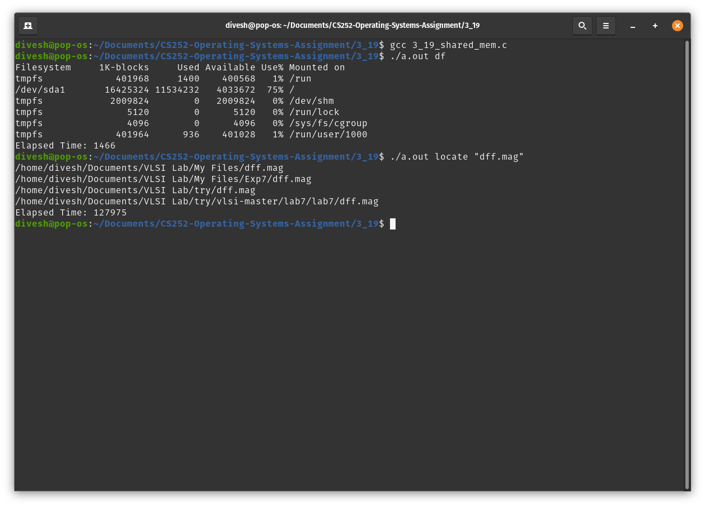
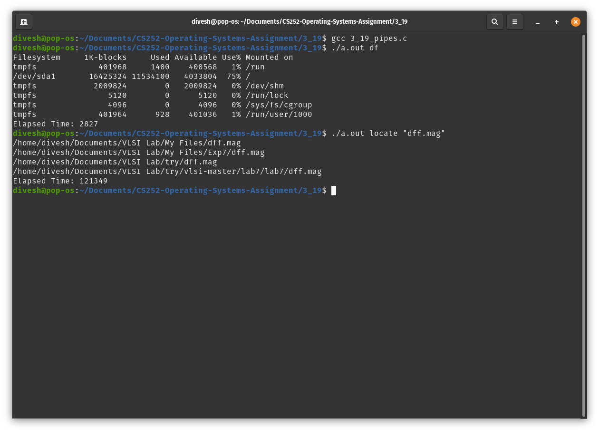

<!-- Programming Exercise 3.19 -->
# Description
To make a C program to run shell commands and record the amount of time taken to run them

# Details
The execise was about writing a C program that will fork a child process which will record the start time and run a shell command and then the parent process will wait for the child process to finish and record the end time and output the time taken to run that command. The exercise asked to solve the problem using two different methods of inter process communication, shared memory and pipes. 

For the first version, a piece of shared memory was created for the child process to write the start time to. After the child process ends, the parent process can read the start time from that shared memory.

The second version used a one-way pipe to communicate between the child and parent process. The child process is going to write the start time on to one end of the pipe and the parent process can read from the other end.

# How to Compile and Run
To compile the C file, run the following command on the terminal:
```sh
   gcc <program_name>.c
```

To run the compiled program:
```sh
   ./a.out <command>
```
where <command> is the shell command that is to be run

# Example Screenshots



