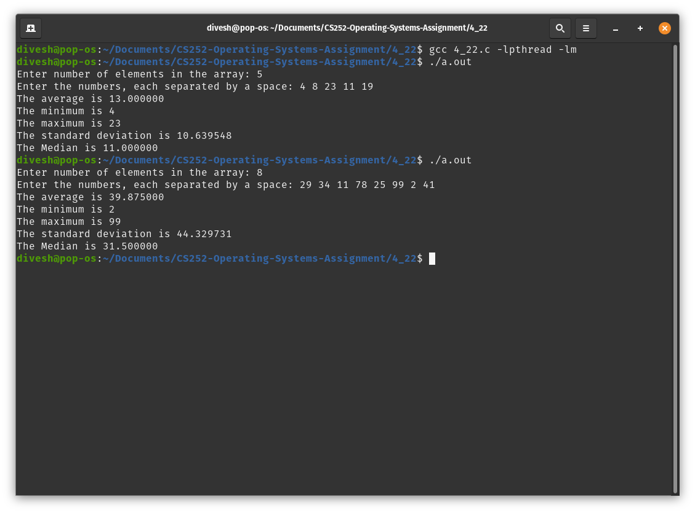

<!-- Programming Exercise 4.22 -->
# Description
A multi-threaded program to calculate differents statistics like maximum, minimum, average, median and standard deviation of an array of numbers.

# Details
Pthreads library was used to create a multithreaded C program. Each thread is given one statistic to calculate. 

# How to Compile and Run
To compile the C file, open the terminal and run the following command:
```sh
   gcc 4_22.c -lpthread -lm
```

To run the compiled program, type:
```sh
   ./a.out
```
and follow the instructions.

# Example Screenshots

